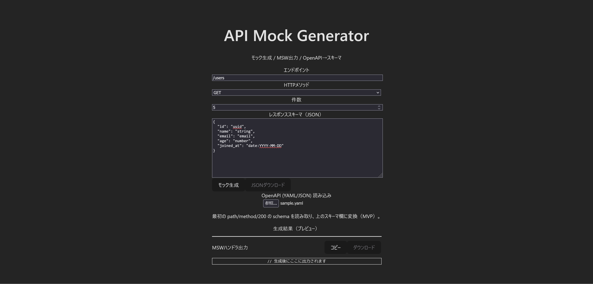

# API Mock Generator (Vue + TypeScript)

OpenAPI (YAML/JSON) から **モックJSON** と **MSWハンドラ** を即生成するツールです。  
バックエンド未完成でもフロント・E2E テストを先行できる“つなぎ役”を目指しています。

- Live Demo: https://hanehane0003.github.io/api-mock-demo/
- Tech: Vue 3 / TypeScript / Vite / Tailwind CSS v4 / @faker-js/faker / js-yaml

## Why
- 仕様はあるが API がまだ：**モックで先に結合テスト**を回したい  
- 手作業でモックを作るのが面倒：**スキーマから自動生成**したい  
- フロントのローカル開発で **MSW** をすぐ立てたい

## Features
- OpenAPI (YAML/JSON) 読み込み → 最初の `paths/method/200` の `application/json` schema を抽出（MVP）
- 型マッピング：`uuid` / `email` / `date` / `date-time` / `string` / `number` / `integer`
- faker によるダミー値生成（件数指定可）
- 1クリックで **MSW ハンドラ出力**（コピー / ダウンロード）

## Screenshots


## Quick Start
```bash
npm install
npm run dev
# http://localhost:5173

